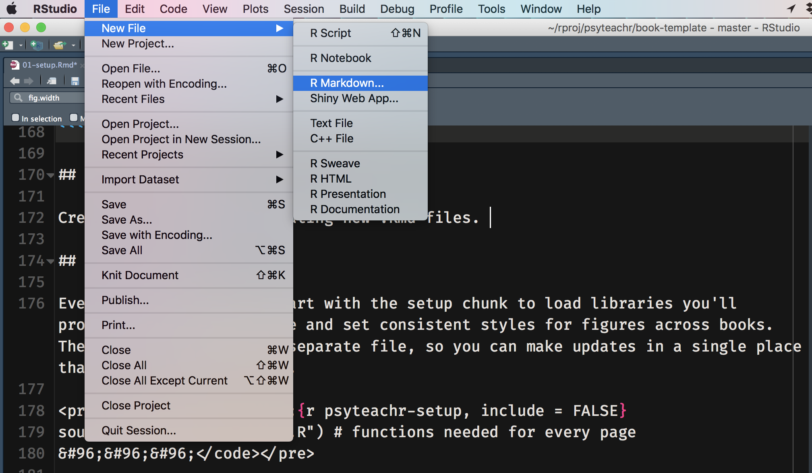

# Setup

## Starting a new book

### Create a new github repository

For psyTeachR courses, the repository should be created by the course lead on the [psyTeachR](https://github.com/PsyTeachR) github and have a name structure like this:

* ug1-practical
* ug2-practical
* ug3-stats
* ug4-dissertation
* msc-data-skills

### Fork the repository

Our main course pages are under https://psyteachr.github.io, but you should work on your course page on a forked version in your own github account. On the **`Code`** tab of the new repository, click the **`Fork`** button.

```{r img-fork, echo=FALSE, out.width='100%', fig.cap="Fork a repository from the psyTeachR account"}
knitr::include_graphics("files/images/fork.png")
```

If you're a member of psyTeachR, you'll get this interface telling you that you've already forked this project. You just need to choose your personal account.

```{r img-already-forked, echo=FALSE, out.width='50%', fig.align='center', fig.cap="Choose your personal account"}
knitr::include_graphics("files/images/already_forked.png")
```

You'll see this animation for a few seconds while the repository is being forked to your account.

```{r img-forking, echo=FALSE, out.width='50%', fig.align='center', fig.cap="Just be patient"}
knitr::include_graphics("files/images/forking.png")
```

### Make a new RStudio project

Click the green **`Clone or download`** button on your personal forked repository and copy the URL (use HTTPS unless you know you've set up SSH).

```{r img-clone, echo=FALSE, out.width='100%', fig.cap="Find the URL to clone"}
knitr::include_graphics("files/images/clone.png")
```

Under the **`File`** menu in RStudio, choose **`New Project...`** and choose **`Version Control`** from the list of options.

```{r img-version-control, echo=FALSE, out.width='50%', fig.align='center', fig.cap="File > New Project... > Version Control"}
knitr::include_graphics("files/images/version_control.png")
```

Choose **`Git`** from the next screen.

```{r img-git, echo=FALSE, out.width='50%', fig.align='center', fig.cap="Choose Git"}
knitr::include_graphics("files/images/git.png")
```

Paste the URL you copied from your repository into the Repository URL. Keep the Project directory name the same as the repository name (it should default to this). You can Create the project as a subdirectory anywhere on your computer; I recommend making a directory to keep all your github R projects in.

```{r img-clone-repo, echo=FALSE, out.width='50%', fig.align='center', fig.cap="Clone your github repository to the RStudio project"}
knitr::include_graphics("files/images/clone_repo.png")
```


### Download the template

Download the [psyTeachR Bookdown Course Template](files/book-template.zip) to you computer, unzip it, and move the files into the directory of your new RStudio project.

### Edit the template

#### _output.yml

Open `_output.yml`. It should look like this:

```
bookdown::gitbook: 
  default: true
  smart: false
  includes:
    after_body: [include/footer.html, include/webex.js]
  css: [include/psyteachr.css, include/style.css]
  config:
    toc:
      collapse: section
      scroll_highlight: yes
      before: |
        <li><a href="./">Book Template</a></li>
      after: |
        <li><a rel="license" href="https://creativecommons.org/licenses/by-sa/4.0/" 
            target="blank"></a><li>
        <li><a href="https://psyteachr.github.io/" target="blank">PsyTeachR</a></li>
    download: []
    fontsettings:
      theme: white
      family: sans
      size: 2
    sharing:
      facebook: yes
      twitter: yes
      google: no
      linkedin: no
      weibo: no
      instapaper: no
      vk: no
      all: ['facebook', 'google', 'twitter', 'linkedin', 'weibo', 'instapaper']
bookdown::pdf_book:
  includes:
    in_header: preamble.tex
  latex_engine: xelatex
  citation_package: natbib
  keep_tex: yes
```

Change "Book Template" in the config:toc:before: section to the name of your book. This is the text readers will see at the top of your table of contents that brings them back to the start of the book.

Save and close this file.

#### _bookdown.yml

Open `_bookdown.yml`. It should look like this:

```
book_filename: "_main"
new_session: yes
output_dir: "docs"
before_chapter_script: ["R/psyteachr_setup.R", "R/my_setup.R"]
delete_merged_file: true
clean: []
language:
  ui:
    chapter_name: "Chapter "
  label:
    fig: 'Figure '
    tab: 'Table '
    eq: 'Equation '
    thm: 'Theorem '
    lem: 'Lemma '
    cor: 'Corollary '
    prp: 'Proposition '
    cnj: 'Conjecture '
    def: 'Definition '
    exm: 'Example '
    exr: 'Exercise '
    proof: 'Proof. '
    remark: 'Remark. '
    solution: 'Solution. '
```

You can change the chapter_name from "Chapter " to "Lab " or something else that makes sense for your course if you want. Leave the labels alone unless you're translating to another language.

Save and close this file.

#### index.Rmd

Open `_index_example.Rmd`. The top YAML header should look like this:

```
--- 
title: "Template Course"
author: "psyTeachR"
date: "`r Sys.Date()`"
site: bookdown::bookdown_site
documentclass: book
bibliography: [book.bib, packages.bib]
biblio-style: apalike
link-citations: yes
description: "This is a template. Use it to start a new course book."
---
```

Update the title, author, and description strings.

For now, don't change anything in the `cite-packages` R chunk at the top. This just automatically creates a bibliography file for the specified R packages.

Now you can edit the overview. Replace the filler text with a description of your course and fill in the course aims and ILOs. 

```{block, type="info"}
The `{-}` at the end of the overview title makes sure this chapter isn't numbered.
```

Save this file with the name `index.Rmd`.

### Render the book

Now you're ready to create the book. Run the following code in the console.

```{r render, eval = FALSE}
bookdown::render_book("index.Rmd")
```

You'll see a lot of text in the console window, which should end in something that looks like:

```
Output created: docs/index.html
[1] "/Users/lisad/rproj/psyteachr/book-template/docs/index.html"
```

The last line is the location of your new book. You can copy and paste that in a web browser to view the book. Alternatively, you can open the docs directory in the Files pane of RStudio, click on index.html, and choose **`View in Web Browser`**.

```{r img-open-from-docs, echo=FALSE, out.width='50%', fig.align='center', fig.cap="Open your book from the Files pane in RStudio."}
knitr::include_graphics("files/images/open_from_docs.png")
```

## Adding chapters

Create new chapters by creating new R Markdown files. Under the **`File`** menu in RStudio, choose **`New File`** and **`R Markdown...`**. Don't bother adding a title or changing any default settings; the first thing we'll do is delete all of the content.

```{r img-new-rmd, echo=FALSE, out.width='100%', fig.align='center', fig.cap="Make a new chapter in a new .Rmd file"}

```

Name the file with the chapter number and a short title all in lowercase, separated by dashes, like `01-getting-started.Rmd`. Chapters will render in alphabetical order by filename (you can specify the order in the yml, but it's a pain), so all chapters need to start with a number or they'll end up in the appendix.

### Content

Start your chapter with a level 1 header. This will be the chapter title. You can then continue to write your chapter in R Markdown.

```{block, type="info"}
You can refer to any section by it's label, which is the section title with spaces changed to dashes (e.g., a section called "Your first R Markdown file" can be referenced as `#Your-first-R-Markdownfile`. You can set a shorter custom label for a section by adding an ID in the format `{#rmarkdown}`.
```

### Multiple .Rmd files per chapter

You can break a chapter up into separate .Rmd files like `01.1-prep`, `01.2-in-class`, `01.3-homework` with a level 1 header only at the start of the first section of the chapter. If you do this, you'll get the following warning when you render the book; you can just ignore it.

```
Warning message:
In split_chapters(output, gitbook_page, number_sections, split_by,  :
  You have 7 Rmd input file(s) but only 6 first-level heading(s). Did you forget first-level headings in certain Rmd files?
```

### Rendering a single chapter

After you've added several chapters, the whole book might take a long time to render. If you want to quickly check the formatting on a single chapter, use the following code.

```{r preview-chapter, eval= FALSE}
bookdown::preview_chapter("02-style-guide.Rmd")
```

### Adding appendices

Add appendices in the same way as chapters. Just name them following the pattern `appendix-a-name.Rmd`.

The file `appendix-0.Rmd` just contains the appendix header that groups appendices together (`# (APPENDIX) Appendices {-}`). You don't need to edit this, but you can delete this file if you are not going to use appendices.

### Automatic setup scripts

Every .Rmd file automatically runs two scripts to load libraries you'll probably use on every page and set consistent styles for figures across books. The code is located in separate files, so you can make updates in a single place that affect every chapter.

If there is a package you'll need in every chapter, you can create a file called `R/my_setup.R`. Don't edit `R/psyteachr_setup.R`; this file is likely to need periodic updating and it is easier to just replace it than to figure out what changes you made. Any code in `R/my_setup.R` will be loaded after and overrule code in `R/psyteachr_setup.R` (e.g., if you want to set a different ggplot theme — but please don't unless you have a good reason!).

## Publishing your book

1. Render the book with `bookdown::render_book("index.Rmd")`
2. Commit your changes
    * (you can do this from the command line if you're comfortable with git)
    * In the **`Git`** paneselect all files,
    * Click one checkbox under **`Staged`** to check them all
    * Click the **`Commit`** button 
    * Write a commit message describing the changes you made
    * Click the **`Commit`** button
3. Push your changes to GitHub
    * click the **`Push`** button with the green up arrow
4. Set up GitHub Pages
    * This only needs to be done once per repository
    * Go to the repository on GitHub
    * Click on the **`Settings`** tab
    * Scroll down to **`GitHub Pages`**
    * Change Source to "master branch /docs folder"
    * If the page refreshes, scroll back down to **`GitHub Pages`** and you should see a green bar with "Your site is published at https://xxxxxx.github.io/repo-name/"
    * Click on the link to see your book
    * It will usually take a few minutes for your files to be copied over to the web server, so refresh a few times
  
## Getting a DOI {#doi}

You can gve your book a DOI using [Zenodo](https://zenodo.org){target="_blank"}. 

#### .zenodo.json {#zenodo}

Open `.zenodo.json`. If you can't see this file, you need to change your settings to be able to see invisible files (that start with `.`). In RStudio, go to the **`Files`** pane, click on **`More`**, and choose **`Show Hidden Files`**.

Edit the file to make it applicable to your book. You can add more authors to the "creators" list. Update the version and publication date each time you update the DOI. We follow the version numbering scheme for [R packages](http://r-pkgs.had.co.nz/description.html#version){target="_blank"}. In-prep (beta) versions should have version numbers starting with 0.0.9000, and the first full release should be 1.0.0. 

```
{
    "description": "The 2019-2020 version of the course book template for the Institute of Neuroscience and Psychology at the University of Glasgow.", 
    "license": "cc-by-sa", 
    "title": "PsyTeachR Book Template", 
    "version": "1.0.0",
    "upload_type": "software", 
    "publication_date": "2020-05-12", 
    "creators": [
        {
            "name": "Lisa DeBruine",
            "affiliation": "University of Glasgow",
            "orcid": "0000-0002-7523-5539"
        },
        {
            "name": "Phil McAleer",
            "affiliation": "University of Glasgow",
            "orcid": "0000-0002-4523-2097"
        }
    ], 
    "access_right": "open", 
    "related_identifiers": [
        {
            "scheme": "url", 
            "identifier": "https://PsyTeachR.github.io/book-template/", 
            "relation": "isSupplementTo"
        }
    ]
}
```

### Setting up a DOI for the first time

1. Log into [Zenodo](https://zenodo.org){target="_blank"} using your github account
2. Go to [GitHub Settings](https://zenodo.org/account/settings/github/){target="_blank"} and follow the instructions to access your github account and enable the relevant repository 
    * Flip the switch to turn on Zenodo for your repository
    * Go to that repository on github.com
    * Click **`releases`**
    * Click the **`Create a new release`** button
    * Make sure the tag version, title, and description are consistent with the version, title, and description in `.zenodo.json`
    * You don't need to attach any files or binaries
    * Check "This is a pre-release" if you are just setting up your DOI and this version isn't complete
    * Click the **`Publish release`** button
3. Add your badge
    * Go back to Zenodo and click on the DOI to get the badge. If it's yellow, then Zenodo is still processing your updates, so wait a minute and refresh until it turns green
    * Copy the HTML version
    * Open `_output.yml` and add the HTML badge as follows:
        ```
        before: |
          <li><a href="./">Book Template</a></li>
          <li><a href="https://zenodo.org/badge/latestdoi/000000000"></a></li>
        ```
    * You can also add the citation to a README file for your repository and anywhere else you like.
    
### Updating your book

You only need to do this when you are publishing a new major version, such as adding new chapters or big revisions between years.

* Make sure the `.zenodo.json` file is up to date
* Create a new release on GitHub
* Go to Zenodo to get your updated DOI and badge (or you can just use the all-versions DOI rather than the version-specific one)