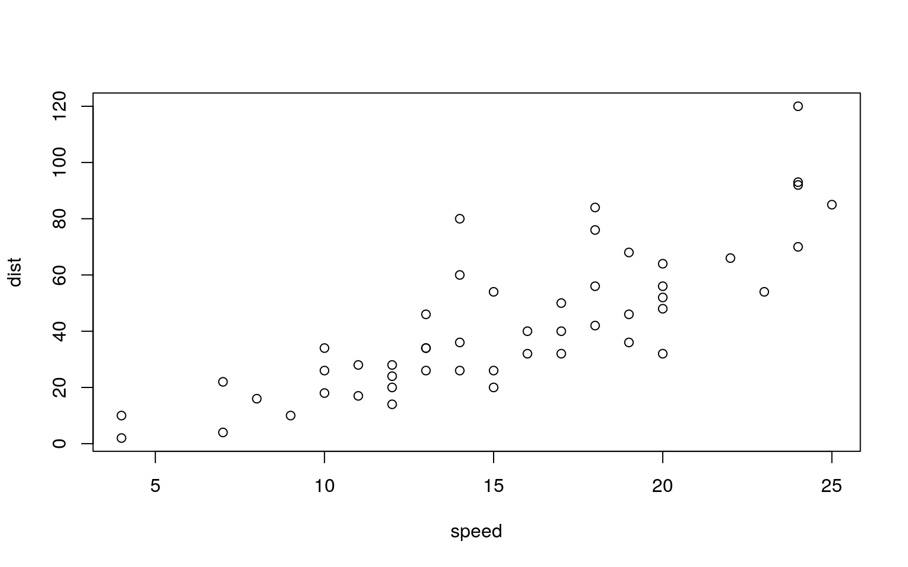
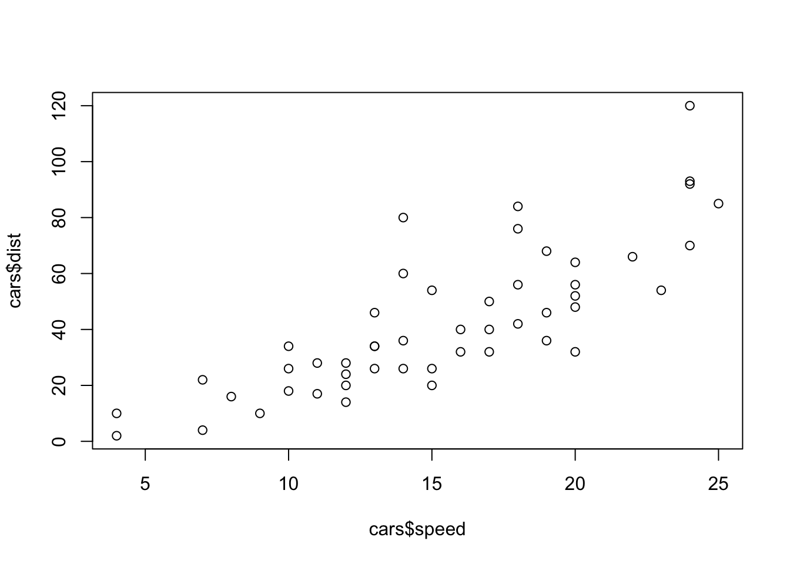

# Webex

Use the following code to install [webex](https://github.com/psyteachr/webex) from CRAN:
```
install.packages("webex")
```

The `webex` package is called in the setup chunk, so you don't need to call it on every page you want to use webex. 

<div class="info">
<p>If you’re using webex outside of this bookdown template, such as in an rmarkdown webpage, you will need to set the output type to <code>webex::webex_default</code> in the yaml header in order to import the css and javascript files. To create a file from the webex template in RStudio, click <strong><code>File -&gt; New File... -&gt; RMarkdown</code></strong> and in the dialog box that appears, select <strong><code>From Template</code></strong> and choose <strong><code>Web Exercises</code></strong>.</p>
</div>

## Fill-In-The-Blanks (`fitb()`) {#fitb}

Create fill-in-the-blank questions using `fitb()`, providing the answer as the first argument (e.g., `fitb("4")`).

- 2 + 2 is <input class='solveme nospaces' size='1' data-answer='["4"]'/>

You can also create these questions dynamically, using variables from your R session (e.g., `x <- sample(2:8, 1); fitb(x)`).


- The square root of 36 is: <input class='solveme nospaces' size='1' data-answer='["6"]'/>

The blanks are case-sensitive; if you don't care about case, use the argument `ignore_case = TRUE` (e.g., `fitb("E", ignore_case = TRUE)`).

- What is the letter after D? <input class='solveme nospaces ignorecase' size='1' data-answer='["E"]'/>

If you want to ignore differences in whitespace use, use the argument `ignore_ws = TRUE` and include spaces in your answer anywhere they could be acceptable (e.g., `fitb("library( tidyverse )")`).

- How do you load the tidyverse package? <input class='solveme nospaces ignorecase regex' size='20' data-answer='["library( tidyverse )","library( &apos;tidyverse&apos; )","library( \"tidyverse\" )"]'/>

You can set more than one possible correct answer by setting the answers as a vector (e.g., `fitb(c("A", "E", "I", "O" , "U"), ignore_case = TRUE)`).

- Type a vowel: <input class='solveme nospaces ignorecase' size='1' data-answer='["A","E","I","O","U"]'/>

## Multiple Choice (`mcq()`) {#mcq}

Make a multiple choice question by setting the first argument to `mcq()` to a vector where the answer(s) are labeled `answer` (e.g., `mcq(c("0", "3.14", answer = "42", "100", "none of the above"))`)

- "Never gonna give you up, never gonna: <select class='solveme' data-answer='["let you down"]'> <option></option> <option>let you go</option> <option>turn you down</option> <option>run away</option> <option>let you down</option></select>"
- "I <select class='solveme' data-answer='["bless the rains"]'> <option></option> <option>bless the rains</option> <option>guess it rains</option> <option>sense the rain</option></select> down in Africa"
- "There's nothing that a hundred men <select class='solveme' data-answer='["or more"]'> <option></option> <option>on Mars</option> <option>or more</option> <option>named Marv</option></select> could ever do"

## True or False (`torf()`) {#torf}

You can make a quick true-of-false option using `torf()` (e.g., `torf(FALSE)`).

- You can permute values in a vector using `sample()`. <select class='solveme' data-answer='["TRUE"]'> <option></option> <option>TRUE</option> <option>FALSE</option></select>

## Hidden solutions and hints (`hide()` and `unhide()`) {#hide-unhide}

You can fence off a solution area that will be hidden behind a button using `hide()` before the solution and `unhide()` after, each as inline R code.  Pass the text you want to appear on the button to the `hide()` function.

If the solution is an RMarkdown code chunk, instead of using `hide()` and `unhide()`, simply set the `webex.hide` chunk option to TRUE, or set it to the string you wish to display on the button.

- Recreate the scatterplot below, using the built-in `cars` dataset.

<div class="figure" style="text-align: center">

<p class="caption">(\#fig:plot-cars)Recreate this scatterplot.</p>
</div>


<div class='solution'><button>I need a hint</button>

`?plot`

</div>


<div class='solution'><button>Click here to see the solution</button>


```r
plot(cars$speed, cars$dist)
```

<div class="figure" style="text-align: center">

<p class="caption">(\#fig:unnamed-chunk-3)**CAPTION THIS FIGURE!!**</p>
</div>

</div>

