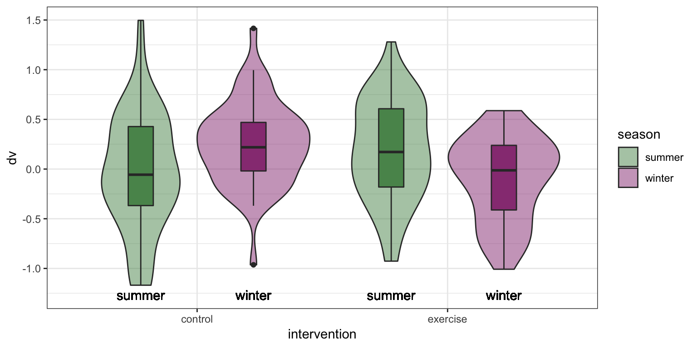
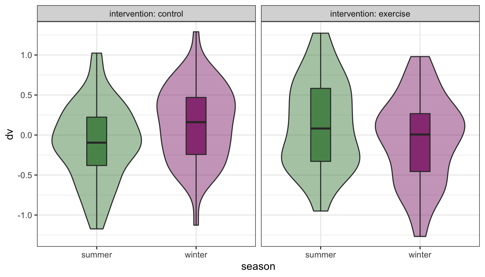
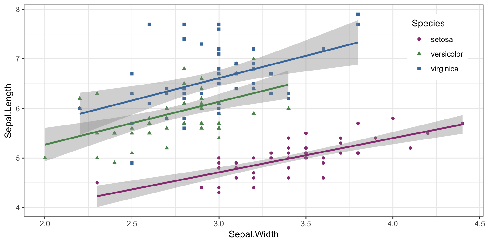

# Inclusion

We want our resources to be accessible to everyone. This means thinking about accessibility with regards to disability, language, identity, and other characteristics. This is a work in progress; feel free to suggest additions.

## Tips for text-readers

Some students need to use text readers for accessibility; others just prefer this method. Here are some tips for improving their experience from the [Dyslexia Style Guide](https://www.bdadyslexia.org.uk/common/ckeditor/filemanager/userfiles/Dyslexia_Style_Guide_2018-final.pdf).

* Use straight quotation marks
* Avoid roman numerals
* Avoid text in figures

Bookdown books allow readers to change the font style, size, and background colour. This provides essential accessibility for some people, such as those with dyslexia or visual impairments. Therefore, avoid putting too much text in figures and provide descriptions of images in the figure caption.

## Resources for blind coders

* [BrailleR](https://github.com/ajrgodfrey/BrailleR): a collection of tools to make use of R a happier experience for blind people
* [Statistical Software from a Blind Person’s Perspective](https://journal.r-project.org/archive/2013/RJ-2013-007/RJ-2013-007.pdf)

## Dyslexia-friendly resources

* [British Dyslexia Association](https://www.bdadyslexia.org.uk/educator)
* [Dyslexia Style Guide](https://www.bdadyslexia.org.uk/common/ckeditor/filemanager/userfiles/Dyslexia_Style_Guide_2018-final.pdf)
* [Dyslexia and Coding](https://datacarpentry.org/blog/2017/09/coding-and-dyslexia): Data Carpentry blog post
* [fcuk](https://cran.r-project.org/web/packages/fcuk/vignettes/fcuk.html): A package designed to help people with clumsy fingers

Some recommendations are highlighted below.

* Avoid underlining, block capitals, and italics -- Use bold instead
* Use boxes and borders ([call-out blocks](#call-out-blocks)) for effective emphasis
* Use left-justified with ragged right edge (don't full-justify)
* Use bullet points and numbering rather than continuous prose
* Use the active voice with concise, direct sentences
* Avoid abbreviations and provide a glossary of jargon

## Colour

You can check your images for how they look to people with different types of colourblindness with the [Coblis Color Blindness Simulator](https://www.color-blindness.com/coblis-color-blindness-simulator/).

Desi Quintans made [dark and light colour-blind safe RStudio themes](https://github.com/DesiQuintans/Pebble-safe).

The "pink" and "green" colours from the [psyteachr_colours()]() function are distinguishable by people with protanopia (red-blind), deuteronopia (green-blind), and tritanopia (blue-blind) colourblindness. You can also use viridis colours with `ggplot2::scale_colour_viridis_d()` and `ggplot2::scale_fill_viridis_d()` (for discrete colours) or `ggplot2::scale_colour_viridis_c()` and `ggplot2::scale_fill_viridis_c()` (for continuous colours).

In plots, add secondary indicators in addition to colour, such as text labels or shapes.

(\#fig:plot-text-labels)Text labels supplement colour information.

(\#fig:plot-text-labels-facet)Facet labels and redundant colour information.

(\#fig:plot-shapes)Supplement point colours with shapes.

## Sex, gender and sexuality

When teaching about experimental design, sex always used to be my go-to example of a two-level between-subjects factor. But this can make some people feel like their very existence is being ignored. In your examples, avoid implicitly assuming heterosexuality or binary gender.

If you want to suggest an in-class exercise that uses data from the students, make sure to choose something that doesn't exclude anyone. 

* Pet owners/non-pet owners
* Normally does/doesn't wear glasses
* Can/can't juggle
* Native/non-native English speakers
* Born in Scotland/elsewhere

